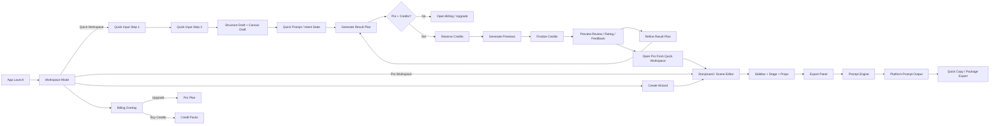
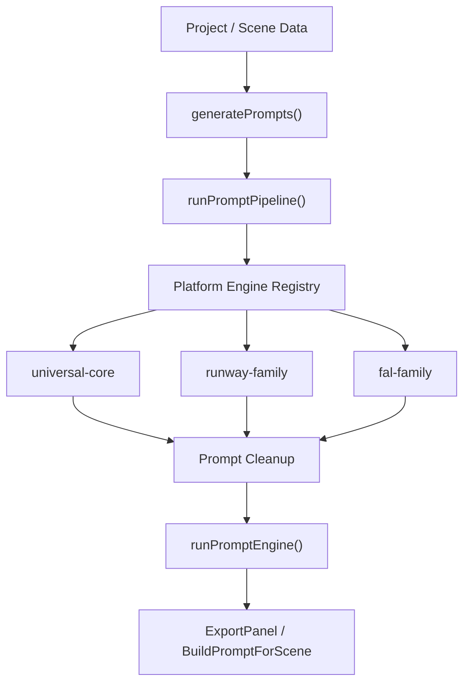
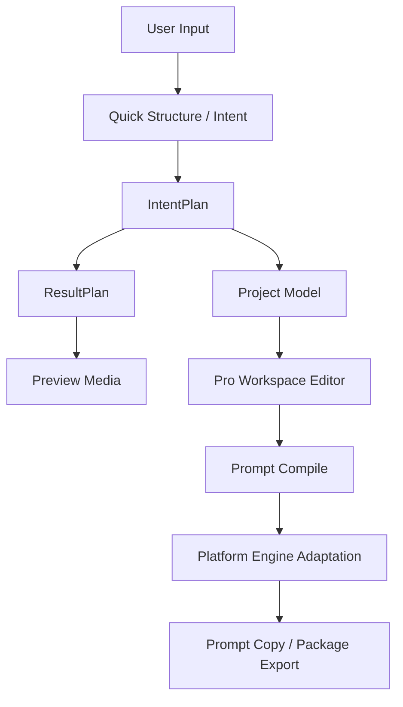

# Scene Pilot Product Flow And Structure

Updated: 2026-03-11

This document describes the current product-facing flow and the corresponding code structure in the repository.

## 1. Product Overview

Scene Pilot currently has two main workspaces:

- `Quick Workspace`
  - Goal: start from a brief quickly, build a structured prompt direction, preview generation results, and decide whether to continue refining or move into Pro editing.
- `Pro Workspace`
  - Goal: edit scenes, layers, references, camera intent, and export prompts/packages in a more formal storyboard workflow.

The app shell lives in `src/App.tsx`, which routes the user between these two workspaces and manages account, credits, billing, local generation runtime state, and export entry points.

## 2. High-Level Product Flow

## 3. User Flow Details

### 3.1 Quick Workspace

Entry:

- `workspaceMode === "results"` in `src/App.tsx`
- Main UI component: `src/components/ResultConsole.tsx`

Current interaction model:

1. User enters first sentence in the first capsule.
2. User confirms step 1 and unlocks the second capsule.
3. User enters second sentence and confirms step 2.
4. System generates:
   - `structureDraft`
   - `canvasDraft`
   - editable quick prompt text
5. Canvas and structure state become active.
6. User can:
   - keep editing the two capsule inputs
   - inspect the right canvas
   - copy/download structure prompt text
   - trigger generation
   - move into Pro mode

Quick Workspace state is mostly local UI state inside `ResultConsole`, but it syncs key intent back to `App.tsx` through:

- `onIntentPlanReady`
- `onStructureChange`
- `onBriefChange`

### 3.2 Quick Generation And Refine

Generation handlers live in `src/App.tsx`:

- `generateResultPlan()`
- `refineResultPlan()`

Current runtime path:

1. Brief is converted into `IntentPlan` if needed.
2. A `ResultPlan` is inferred from brief + prefs + structure.
3. Hosted generation entitlement is checked.
4. Required credits are calculated.
5. Credits are reserved.
6. Previews are generated.
7. Reserved credits are finalized on success or rolled back on failure.
8. Preview list, rating state, feedback state, and synced Quick-to-Pro project state are updated.

Quick generation is therefore not just UI mock state anymore. It is already tied to account entitlement and credits flow.

### 3.3 Move From Quick To Pro

Quick-to-Pro bridge lives in `src/App.tsx`:

- `openProFromQuickWorkspace()`
- `applyIntentPlanToPro()`
- `syncQuickWorkspaceProject()`

Current behavior:

- Quick Workspace produces an `IntentPlan`
- `intentPlanToProProject(...)` converts that into the formal storyboard project model
- if user lacks Pro console entitlement, app stores a pending handoff and opens account/billing
- if user has entitlement, app switches to `workspaceMode === "pro"`

### 3.4 Pro Workspace

When `workspaceMode !== "results"`, the app renders the editor stack:

- `Sidebar`
- `Stage`
- `PropsPanel`
- `ExportPanel`

This is the formal project editing path:

- `Sidebar` manages scenes and layer selection
- `Stage` manages canvas editing and spatial layout
- `PropsPanel` edits properties for current scene/layer
- `ExportPanel` compiles platform-specific prompt output

### 3.5 Export Flow

Main component:

- `src/components/ExportPanel.tsx`

Prompt build path:

1. Build prompt project for current scene or sequence.
2. Run `runPromptEngine(...)`.
3. Prompt engine calls `runPromptPipeline(...)`.
4. Pipeline compiles universal prompt core.
5. Platform engine adapts the prompt for the target platform.
6. Final copy/export output is shown in Quick Export or Package Export flow.

Conflict handling is built into export:

- scene conflicts are detected before copy/save actions
- user can jump back to offending layer/scene data

### 3.6 Billing And Credits

Billing UI:

- `src/components/billing/BillingOverlay.tsx`

Entitlement logic:

- `src/utils/entitlement.ts`

Billing state/services:

- `src/services/billingService.ts`
- `src/services/creditService.ts`

Current product rule:

- `Free`
  - structure tools
  - prompt export
  - no hosted AI generation
- `Pro`
  - hosted generation allowed
  - Pro still uses credits
- credit packs and monthly Pro credits are handled separately

## 4. Current Product Structure

### 4.1 App Shell

- `src/App.tsx`
  - root shell
  - workspace routing
  - account/auth state
  - billing modal state
  - credits state
  - local runtime probing
  - quick generation/refine handlers
  - Pro workspace editor state

### 4.2 Quick Workspace

- `src/components/ResultConsole.tsx`
  - two-step input flow
  - structure draft creation
  - quick canvas
  - preview list and review interactions
  - Quick-to-Pro entry

Related helpers:

- `src/utils/briefParser.ts`
- `src/utils/feedbackToStructure.ts`
- `src/utils/refineStrategy.ts`
- `src/utils/intentPlanToProject.ts`

### 4.3 Pro Workspace

- `src/components/Sidebar.tsx`
- `src/components/Stage.tsx`
- `src/components/PropsPanel.tsx`
- `src/components/ExportPanel.tsx`

Underlying domain model:

- `src/model.ts`

### 4.4 Prompt System

Current prompt chain is now layered like this:

Main files:

- `src/utils/prompt.ts`
  - universal prompt compile
- `src/utils/promptPipeline.ts`
  - compile + adapt + cleanup pipeline
- `src/utils/promptEngine.ts`
  - workspace/media-specific output shaping
- `src/utils/platformAdapter.ts`
  - compatibility facade into platform engine library
- `src/utils/promptEngines/`
  - platform prompt engine registry and engine implementations

This is now the core extensibility layer for future platform-specific prompt behavior.

### 4.5 Platform Prompt Engine Library

Current structure:

- `src/utils/promptEngines/types.ts`
  - shared types
- `src/utils/promptEngines/shared.ts`
  - common adaptation utilities
- `src/utils/promptEngines/builtin.ts`
  - built-in engines
- `src/utils/promptEngines/index.ts`
  - registry and registration API

Current built-in engines:

- `universal-core`
- `runway-family`
- `fal-family`

Design intent:

- universal behavior remains usable
- platform families can gradually gain native prompt rules
- later platforms can be added without rewriting export callers

## 5. Product Data Flow

Key data forms:

- `brief`
  - raw user text
- `IntentPlan`
  - parsed semantic intent for subject / scene / flow
- `ResultPlan`
  - generation-facing quick output plan
- `Project`
  - formal editable storyboard/project model
- prompt outputs
  - platform-adapted text for export or generation

## 6. Current Product Decisions Reflected In Code

1. Quick Workspace is not only a landing page.
   - It already owns structured input, preview generation, and Quick-to-Pro conversion.

2. Pro Workspace is the formal editing and export system.
   - It is still the most complete project-editing mode.

3. Billing is enforced at generation time.
   - Hosted generation checks `Pro` entitlement and credits before running.

4. Prompt generation is becoming a product capability, not just a helper.
   - The new prompt engine registry is the base for platform-specific differentiation.

5. Platform strategy is now expandable.
   - The system can keep one universal path while adding native engines over time.

## 7. Recommended Next Documentation Splits

If the product keeps growing, split this file into:

- `docs/product-quick-workspace.md`
- `docs/product-pro-workspace.md`
- `docs/prompt-engine-library.md`
- `docs/billing-and-entitlements.md`

