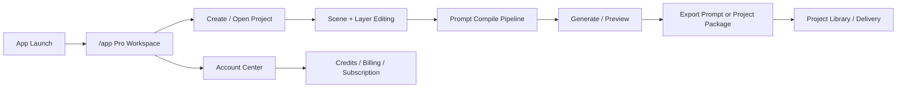

# Scene Pilot Product Flow And Structure

Updated: 2026-03-19

This document describes the current product-facing flow and corresponding repository structure.

## 1. Product Overview

Scene Pilot now uses a single workspace model:

- `Pro Workspace`
  - Goal: convert user intent into editable storyboard structure, generate platform-adapted prompts, and export project-ready delivery artifacts.

The app shell lives in `src/App.tsx` and manages account/auth, credits/billing, project state, prompt compilation, generation actions, and export entry points.

## 2. High-Level Product Flow

## 3. User Flow Details

### 3.1 Pro Workspace Core

Main components:

- `src/components/Sidebar.tsx`
- `src/components/Stage.tsx`
- `src/components/PropsPanel.tsx`
- `src/components/ExportPanel.tsx`

Core behavior:

1. User edits scene structure and object layers.
2. Scene-level strategy and object-level properties are validated together.
3. Prompt compiler generates platform-adapted outputs.
4. User copies prompt text or exports project package.

### 3.2 Generation and Credits

Generation and entitlement logic lives in `src/App.tsx` and billing services.

Current path:

1. Validate auth and entitlement.
2. Reserve credits when required.
3. Trigger generation flow.
4. Finalize or rollback reserved credits.
5. Sync account balances and ledger.

### 3.3 Export Flow

- Main component: `src/components/ExportPanel.tsx`
- Prompt build path:
  1. Build prompt project (current scene or sequence)
  2. `runPromptEngine(...)`
  3. `runPromptPipeline(...)`
  4. Platform adaptation
  5. Copy/export outputs

Conflict checks run before export actions to prevent invalid structure from shipping.

## 4. Repository Structure (Product-Critical)

### 4.1 App Shell

- `src/App.tsx`
  - Root shell and route-level state orchestration
  - Auth/account state
  - Billing and credits state
  - Project lifecycle state

### 4.2 Editor Surface

- `src/components/Sidebar.tsx`
- `src/components/Stage.tsx`
- `src/components/PropsPanel.tsx`
- `src/features/pro-workspace/*`

### 4.3 Prompt Engine

- `src/utils/prompt.ts`
- `src/utils/promptEngine.ts`
- `src/utils/promptPipeline.ts`
- `src/utils/promptEngines/*`

### 4.4 Billing and Auth

- `src/services/authService.ts`
- `src/services/billingService.ts`
- `functions/api/auth/*`
- `functions/api/billing/*`
- `functions/api/paddle/*`

## 5. Notes

- Legacy dual-workspace references are archived context only and must not be reintroduced into active flow docs.
