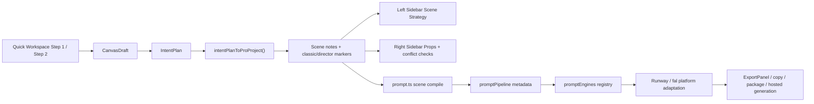

# Scene Strategy Network Audit

## Scope

This audit checks whether `sceneStrategy` is now connected from Quick Workspace input through Pro editing, prompt compilation, platform adaptation, and export.

## Current End-to-End Flow

## What Is Connected Now

### 1. Quick Workspace to Pro is no longer strategy-blind

- `CanvasDraft` still becomes `IntentPlan`.
- `IntentPlan.canvas` is now used to infer `Classic Mode` and `Directing Pack` markers before the Pro project is built.
- This bridge lives in:
  - `/Users/dk/scene-pilot/src/utils/sceneStrategyBridge.ts`
  - `/Users/dk/scene-pilot/src/utils/intentPlanToProject.ts`

Result:

- Quick-first projects entering Pro now carry scene-strategy markers.
- Left sidebar no longer starts from an empty strategy state after Quick handoff.

### 2. Left and right panels now share the same scene-level context

- Left sidebar owns:
  - `Classic Mode`
  - `Directing Pack`
  - `Shot / Movement / Transition / Lighting`
- Right sidebar now reads the effective scene strategy and shows:
  - current classic mode
  - current directing pack
  - effective camera
  - effective lighting

Files:

- `/Users/dk/scene-pilot/src/components/Sidebar.tsx`
- `/Users/dk/scene-pilot/src/components/PropsPanel.tsx`
- `/Users/dk/scene-pilot/src/utils/sceneStrategyResolver.ts`

Result:

- Right-side object editing is no longer blind to scene-level direction.
- Users can see what the scene strategy is before writing object-local prompt text.

### 3. Right sidebar is less likely to pollute scene-level controls

The main scene-level leakage points were:

- background presets with lighting baked in
- object look presets with lighting/cinematic language baked in
- notes presets that pushed global cinematic wording into object-local notes

These were reduced so the right panel stays more object-local.

Conflict detection also now warns when object-local notes or object-local pasted prompts try to override camera/composition/lighting while a scene strategy is active.

Files:

- `/Users/dk/scene-pilot/src/components/PropsPanel.tsx`
- `/Users/dk/scene-pilot/src/utils/conflictRules.ts`

### 4. Scene strategy now reaches platform engines as metadata

`promptPipeline` now sends strategy metadata into platform adaptation:

- layer: `none / classic / director / mixed`
- classic mode ids
- director pack ids
- advanced-language flag
- lighting-defaults flag

Files:

- `/Users/dk/scene-pilot/src/utils/promptPipeline.ts`
- `/Users/dk/scene-pilot/src/utils/promptEngines/types.ts`
- `/Users/dk/scene-pilot/src/utils/promptEngines/shared.ts`

### 5. Runway and fal now receive different strategy distributions

Current first-pass distribution:

- `Runway`
  - prioritizes motion continuity, transition readability, and scene lighting anchors
  - treats advanced grammar as secondary to motion execution
- `fal`
  - prioritizes object hierarchy, composition anchors, material readability, and scene lighting anchors
  - treats advanced visual language as secondary to composition clarity

File:

- `/Users/dk/scene-pilot/src/utils/promptEngines/builtin.ts`

This is not the final platform-specialized compiler, but it is no longer generic-only.

### 6. Quick preview generation and Pro export are closer to the same project model

Quick video prompt generation previously had a split path:

- one path for Quick preview prompts
- another path for Quick -> Pro handoff

Now `buildScenePromptsForPlan()` prefers `IntentPlan.canvas -> intentPlanToProProject()` when canvas data exists.

File:

- `/Users/dk/scene-pilot/src/App.tsx`

Result:

- Quick preview prompts and Pro handoff now share the same structural project builder much more often.

## Current Residual Fragmentation

The network is substantially connected now, but not mathematically complete yet.

### Residual 1. Scene strategy inference from Quick Workspace is heuristic

Current bridge logic maps Quick selections into classic/director packs with heuristics.

File:

- `/Users/dk/scene-pilot/src/utils/sceneStrategyBridge.ts`

Implication:

- The bridge is coherent, but not yet authoritatively derived from one canonical strategy schema.
- Long term, Quick Workspace should emit strategy ids directly instead of needing inference.

### Residual 2. Platform engines still receive summary metadata, not full structured strategy blocks

Right now platform engines know:

- which pack family is active
- whether lighting defaults are active
- whether advanced language is active

They do **not** yet receive a full normalized strategy object like:

- camera bias
- transition bias
- lighting hard defaults
- lighting soft cues
- rhythm bias
- per-pack platform rendering instructions

Implication:

- Better than generic adaptation
- Not yet the final platform-native scene strategy compiler

### Residual 3. Legacy stability data still exists in the domain model

Prompt generation and sidebar logic no longer use `stability`, and new Quick->Pro project conversion no longer writes it.

But the core model still supports it for backward compatibility.

File:

- `/Users/dk/scene-pilot/src/model.ts`

Implication:

- Not an active behavior bug now
- Still a legacy surface in the data model

## Assessment

### What is true now

- The system is no longer obviously fragmented between left panel, right panel, Quick handoff, prompt compilation, and platform adaptation.
- `sceneStrategy` is now a real cross-layer concept instead of a UI-only concept.
- The “whole network” is mostly present.

### What is not fully true yet

- The network is not yet a single canonical semantic graph.
- Quick Workspace still infers strategy rather than emitting strategy ids directly.
- Platform compilers still consume summarized strategy metadata instead of a full structured strategy contract.

## Recommended Next Step

Build a canonical `SceneStrategyContract` object and pass it through all layers:

1. Quick Workspace emits it directly
2. Pro sidebar edits it directly
3. Props panel reads it directly
4. prompt compiler consumes it directly
5. platform engines receive the normalized contract, not only summary metadata

That would be the point where the system can be called fully non-fragmented.
