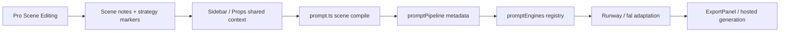

# Scene Strategy Network Audit

Updated: 2026-03-19

## Scope

This audit checks whether `sceneStrategy` is connected end-to-end in the current Pro-only workflow: editor state -> prompt compilation -> platform adaptation -> export/generation.

## Current End-to-End Flow

## What Is Connected Now

### 1. Pro editor state is strategy-aware across panels

- Scene-level strategy and object-level edits are resolved in one context.
- Sidebar and Props panel both read effective strategy state before compile.

Files:

- `/Users/dk/scene-pilot/src/components/Sidebar.tsx`
- `/Users/dk/scene-pilot/src/components/PropsPanel.tsx`
- `/Users/dk/scene-pilot/src/utils/sceneStrategyResolver.ts`

### 2. Strategy reaches prompt pipeline metadata

Files:

- `/Users/dk/scene-pilot/src/utils/promptPipeline.ts`
- `/Users/dk/scene-pilot/src/utils/promptEngines/types.ts`
- `/Users/dk/scene-pilot/src/utils/promptEngines/shared.ts`

Current metadata includes strategy layer and key strategy switches for downstream adaptation.

### 3. Platform adaptation is differentiated

- `Runway`: continuity and motion readability bias.
- `fal`: composition/object hierarchy/material readability bias.

File:

- `/Users/dk/scene-pilot/src/utils/promptEngines/builtin.ts`

## Residual Gaps

### 1. Contract is still summarized, not fully canonical

Platform engines consume summarized strategy metadata, not a full normalized `SceneStrategyContract` payload.

### 2. Legacy compatibility fields still exist in model surface

Some backward-compatible fields remain in model types for old project loading.

## Assessment

- The Pro path is materially connected and no longer panel-fragmented.
- Remaining work is contract normalization depth, not basic network wiring.

## Next Step

Define a canonical `SceneStrategyContract` and pass it through:

1. Pro editor state
2. Prompt compiler
3. Pipeline metadata
4. Platform adaptation
5. Export/generation surfaces

## Notes

- Legacy dual-workspace references in older audits are archived context only.
